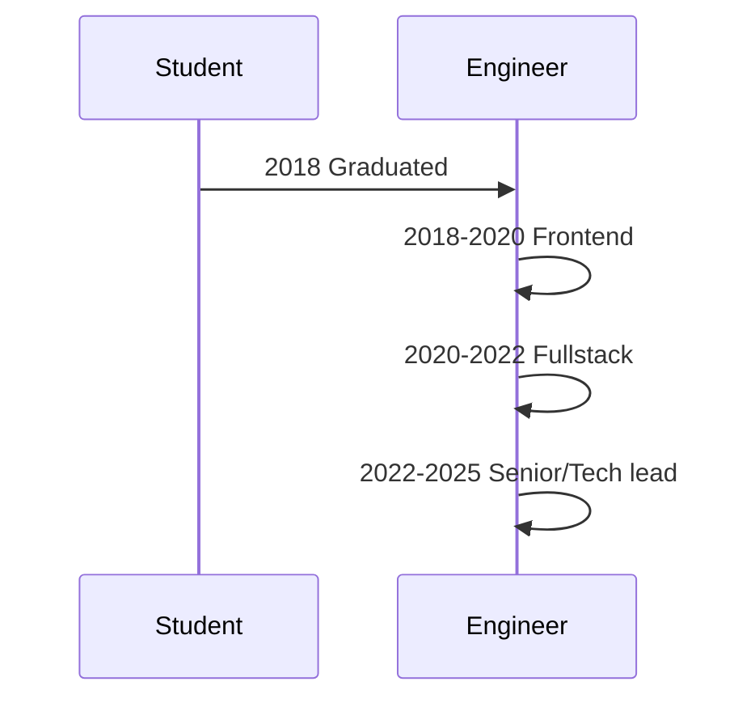
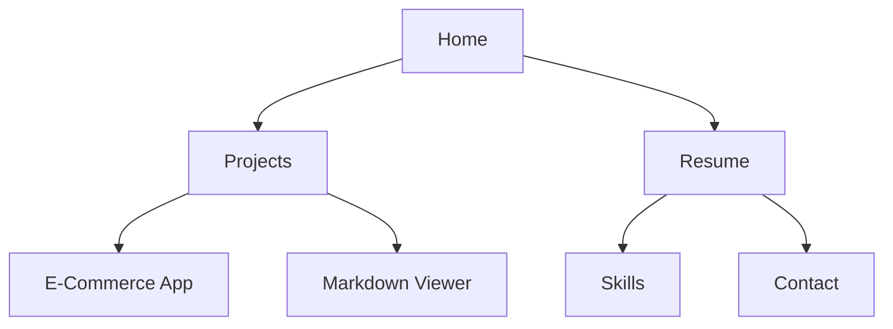

# Profile 

## 🧾 Summary 

**Name**: `<Your Name>`

**Role**: Software Engineer / Frontend / Fullstack

**One-liner**: I build user-centered products with clean architecture and automated pipelines. See the Japanese section above if you prefer.

**Contact**:

* Email: `your.email@example.com`
* GitHub: `github.com/yourusername`
* Website: `https://yourdomain.example`

## 📚 Skills 

* **Languages**: JavaScript/TypeScript, Go, Dart(Flutter), Python
* **Frameworks**: React, Next.js, Flutter, Express, Gin
* **DB / Infra**: PostgreSQL, MongoDB, Docker, Terraform, Nginx
* **Tools**: Git, GitHub Actions, Playwright, Jest

## 🛠 Projects 

### 1) E-Commerce Web App

* **Role**: Fullstack (Flutter Web frontend / Go backend)
* **Overview**: Modern e-commerce site with product listing, cart, and checkout.
* **Highlights**: Local development with Docker Compose and CI-driven deployment.

### 2) Markdown Blog Viewer

* **Role**: Frontend (Next.js + TypeScript)
* **Overview**: Renders Markdown files stored under `/content/mdblog/**`, supports Mermaid diagrams.
* **Highlights**: Webhook + GitHub Actions automatic content updates.

## 🗺 Career Timeline (Mermaid)

## 📦 Site Structure (Mermaid: simple graph)

