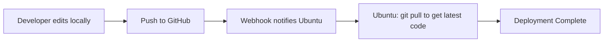
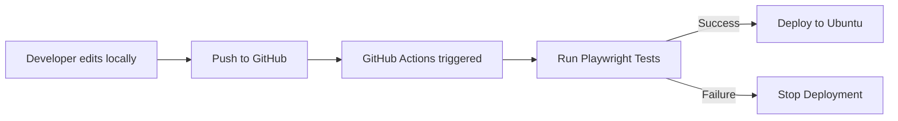

# **Deployment Flow (Markdown + Mermaid)**

## **Flow1: Webhook Deployment Flow**

### **Description**

Developer edits code locally and pushes it to GitHub.
GitHub Webhook sends a notification to the Ubuntu server, and the server runs `git pull` to fetch and update to the latest repository version.

### **Mermaid**

---

## **Flow2: GitHub Actions (Playwright + Next.js) Deployment Flow**

### **Description**

Developer edits code locally and pushes changes to GitHub.
GitHub Actions runs Playwright tests, and if they pass, it deploys to the Ubuntu server.

### **Mermaid**

