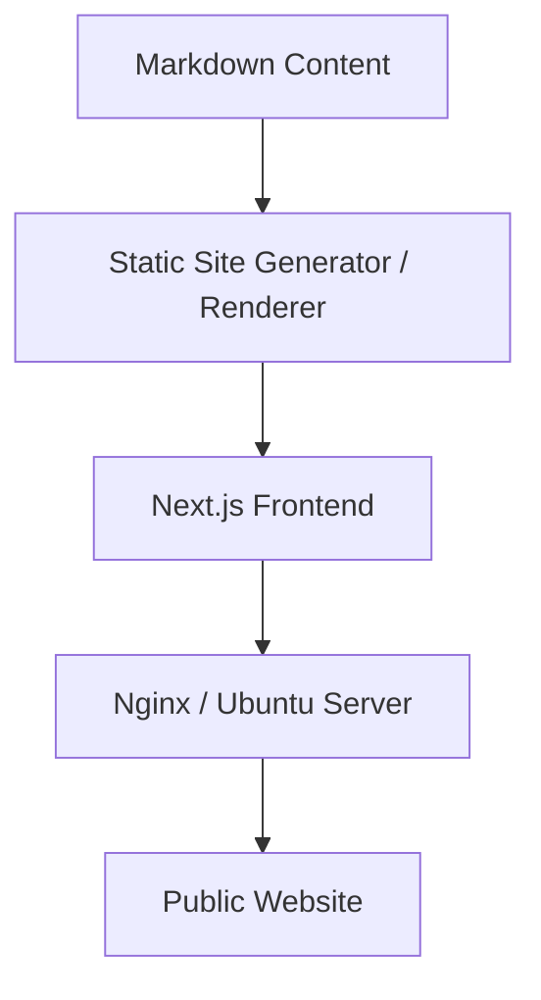

# 🚀 Welcome to My Tech Blog

Stay updated with practical insights from real-world development.
I share what I learn every day — from backend engineering to frontend design, cloud infrastructure, system architecture, and everything in between.

---

## 💡 What You’ll Find Here

* **In-depth technical posts** on modern web development
* **Step-by-step tutorials** for building apps
* **System design guides** for scalable services
* **Code snippets, best practices, and patterns**
* **My learning journey**, including skills and education
* **Project case studies** from personal and professional work

---

## 🧠 My Core Skills

* **Frontend:** React, Next.js, TypeScript, TailwindCSS
* **Backend:** Spring Boot, Node.js, Express, .NET
* **Infrastructure:** AWS, Docker, CI/CD with GitHub Actions
* **Databases:** MySQL, PostgreSQL
* **Tools:** Neovim, VSCode, Git, Linux (Ubuntu)

---

## 🏗 Tech Stack of This Blog

---

## 🎓 My Background

I’m a developer who enjoys learning new technologies, experimenting with frameworks, and building real products.
This blog is the place where I document my growth and share everything I learn along the way.

---

## ✨ Why This Blog Exists

Because learning in public accelerates growth.
And sharing knowledge helps both me — and you.

---

## 📬 Stay Connected

More content is coming soon.
Check back often, or follow along as I build, break, fix, and learn.
