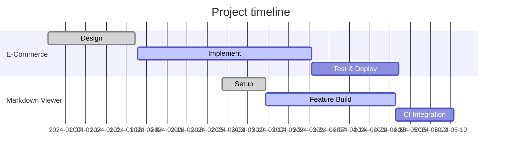

# ポートフォリオ / Portfolio

## 🧾 概要 

**名前**: `<氏名をここに記入>`

**職種 / Role**: ソフトウェアエンジニア / フロントエンドエンジニア / フルスタックエンジニア

**一言**: ユーザー視点の設計と堅牢な実装を重視するエンジニアです。短く読みたい方は英語版（下）を参照してください。

**連絡先**:

* メール: `your.email@example.com`
* GitHub: `github.com/yourusername`
* Web: `https://yourdomain.example`

## 📚 スキルセット 

* **言語**: JavaScript/TypeScript, Go, Dart(Flutter), Python
* **フレームワーク**: React, Next.js, Flutter, Express, Gin
* **DB / インフラ**: PostgreSQL, MongoDB, Docker, Terraform, Nginx
* **ツール**: Git, GitHub Actions, Playwright, Jest

## 🛠 プロジェクト 

### 1) E-Commerce Web App

* **役割**: フルスタック開発 (フロント: Flutter Web / バック: Go)
* **概要**: 商品一覧、カート、決済フローを含むモダンなECサイト。
* **ポイント**: Docker Composeを使ったローカル開発、CIで自動デプロイ。

### 2) Markdown Blog Viewer

* **役割**: フロントエンド (Next.js + TypeScript)
* **概要**: Git 管理下の `/content/mdblog/**` を読み込み、Mermaid をサポートした Markdown 表示。
* **ポイント**: Webhook と GitHub Actions を使った自動更新フロー。

## 🗺 キャリアタイムライン (Mermaid)

```mermaid
flowchart LR
  A[2018] --> B[2020]
  B --> C[2022]
  C --> D[2025]
  A[2018]\n新卒入社 --> B[2020]\nフロント開発担当
  B --> C[2022]\nフルスタック移行
  C --> D[2025]\n現職・リード候補
```

## 📈 プロジェクトスケジュール (Mermaid ガント)



---

## カスタマイズ方法 / How to customize

1. このファイル内の `<...>` をあなたの情報に置き換えてください。 (Replace placeholders)
2. Mermaid の日付や節点は自由に編集できます。 (Edit mermaid blocks)
3. 必要なら PDF に変換して配布できます（Markdown → PDF ツールを使用）。
