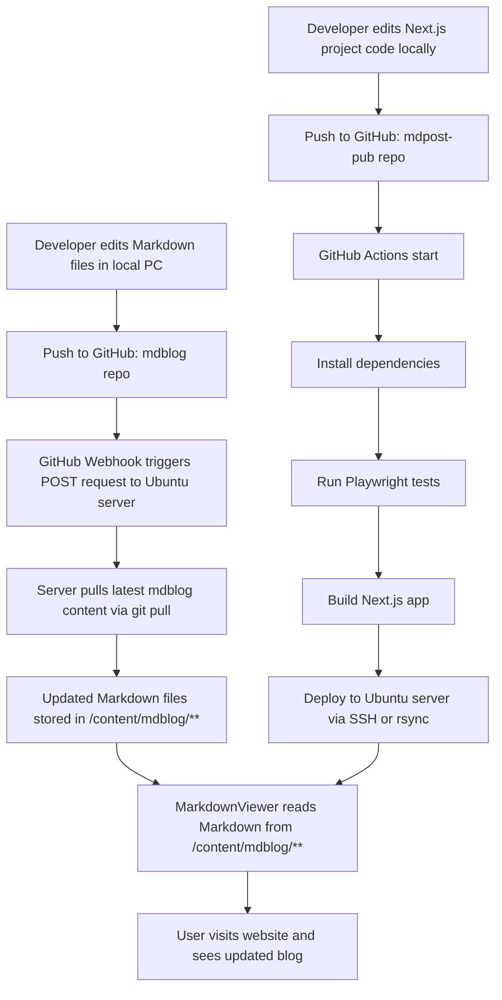

# Markdown File Viewer - Deployment Flow
## Overview
There are two GitHub repositories:
1. `mdblog`
    - Stores Markdown files under `/content/mdblog/**`
    - Uses GitHub Webhook -> Notifies server when Markdown files change.
2. `MarkdownViewer` (mdpost-pub) (Next.js + Playwright)
    - Reads Markdown files and displays them as blog pages.
    - Uses GitHub Actions for automatic build -> test -> deploy.

---

## Deployment Flow 

---

## Explanation
### mdblog Repository Flow
- Push `.md` files -> GitHub
- GitHub **webhook** sends a request to Ubuntu server
- Server runs `git pull` -> updates Markdown content
- Next.js app reads these files automatically

### MarkdownViewer Repository Flow
- Push Next.js code to GitHub
- GitHub Actions:
    1. Install dependencies
    2. Run Playwright tests
    3. Build Next.js
    4. Deploy to Ubuntu server
